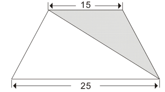

# Java基础题 题目与答案解析

## 题目

### 1.第一个程序

- **题目描述**

  同学们，动手写出第一个C语言或C++或Java或任意语言程序吧！

  打开你的编译器，打印一句话，在屏幕上显示出 Just do IT

  写下你的决心吧！


- **输入格式**

  没有输入，程序运行起来直接输出这句话就可以


- **输出格式**

  Just do IT


- **样例输入**

  ```
  无
  ```


- **样例输出**

  ```
  Just do IT
  ```

### 2.计算球体积

- **题目描述**

  根据输入的半径值，计算球的体积。

- **输入格式**

  输入数据有多组，每组占一行，每行包括一个实数，表示球的半径。

- **输出格式**

  输出对应的球的体积，对于每组输入数据，输出一行，计算结果保留三位小数。

- **样例输入**

  ```
  1
  1.5
  ```

- **样例输出**

  ```
  4.189
  14.137
  ```


### 3.A+B Problem

- 题目描述

输入两个自然数，输出他们的和。

- 输入格式

输出两个自然数 x,y。

- 输出格式

一个数，即x和y的和。

- 样例输入

```
123 500
```

- 样例输出

```
623
```

### 4.计算（a+b）*c的值

- 题目描述

给定3个整数a、b、c，计算表达式(a+b)*c的值。

- 输入格式

输入仅一行，包括三个整数a、b、c, 数与数之间以一个空格分开。
(－10,000 < a,b,c < 10,000)

- 输出格式

输出一行，即表达式的值。

- 样例输入

```
2 3 5
```

- 样例输出

```
25
```

### 5.计算（a+b）/c的值

- 题目描述

给定3个整数a、b、c，计算表达式(a+b)/c的值，/是整除运算。

- 输入格式

输入仅一行，包括三个整数a、b、c, 数与数之间以一个空格分开。(－10,000 < a,b,c < 10,000, c不等于0)

- 输出格式

输出一行，即表达式的值。

- 样例输入

```
1 1 3
```

- 样例输出

```
0
```

### 6.带余除法

- 题目描述

给定被除数和除数，求整数商及余数。

此题中请使用默认的整除和取余运算，无需对结果进行任何特殊处理。看看程序运行结果与数学上的定义有什么不同？

- 输入格式

一行，包含两个整数，依次为被除数和除数（除数非零），中间用一个空格隔开。

- 输出格式

一行，包含两个整数，依次为整数商和余数，中间用一个空格隔开。

- 样例输入

```
10 3
```

- 样例输出

```
3 1
```

### 7.甲流疫情死亡率

- 题目描述

甲流并不可怕，在中国，它的死亡率并不是很高。请根据截止2009年12月22日各省报告的甲流确诊数和死亡数，计算甲流在各省的死亡率。

- 输入格式

输入仅一行，有两个整数，第一个为确诊数，第二个为死亡数。

- 输出格式

输出仅一行，甲流死亡率，以百分数形式输出，精确到小数点后3位。

- 样例输入

```
10433 60
```

- 样例输出

```
0.575%
```

- 提示

输出%可以使用printf(“%%”);

### 8.计算多项式的值

- 题目描述

对于多项式f(x) = ax3 + bx2 + cx + d 和给定的a, b, c, d, x，计算f(x)的值。

- 输入格式

输入仅一行，包含5个实数，分别是x，及参数a、b、c、d的值，每个数都是绝对值不超过100的双精度浮点数。数与数之间以一个空格分开。

- 输出格式

输出一个实数，即f(x)的值，保留到小数点后7位。

- 样例输入

```
2.31 1.2 2 2 3
```

- 样例输出

```
33.0838692
```

### 9.与圆相关的计算

- 题目描述

给出圆的半径，求圆的直径、周长和面积。

- 输入格式

输入包含一个实数r（0 < r <= 10,000），表示圆的半径。

- 输出格式

输出一行，包含三个数，分别表示圆的直径、周长、面积，数与数之间以一个空格分开，每个数保留小数点后4位。

- 样例输入

```
3.0
```

- 样例输出

```
6.0000 18.8495 28.2743
```

- 提示

如果圆的半径是r，那么圆的直径、周长、面积分别是2*r、2 * pi * r、pi * r * r，其中约定pi＝3.14159。
可以使用printf("%.4f", ...)实现保留小数点后4位。

### 10.计算并联电阻的阻值

- 题目描述

对于阻值为r1和r2的电阻，其并联电阻阻值公式计算如下：

R = 1/(1/r1 + 1/r2)

- 输入格式

两个电阻阻抗大小，浮点型，以一个空格分开。

- 输出格式

并联之后的阻抗大小，结果保留小数点后2位。

- 样例输入

```
1 2
```

- 样例输出

```
0.67
```

- 提示

计算过程使用float类型。

### 11.计算浮点数相除的余数

- 题目描述

计算两个双精度浮点数a和b的相除的余数，a和b都是正数的。这里余数（r）的定义是：a = k * b + r，其中 k是整数， 0 <= r < b。

- 输入格式

输入仅一行，包括两个双精度浮点数a和b。

- 输出格式

输出也仅一行，a÷b的余数。

- 样例输入

```
73.263 0.9973
```

- 样例输出

```
0.4601
```

- 提示

注意：输出时小数尾部没有多余的0，可以用下面这种格式：
double x;
x = 1.33;
printf("%g", x);

### 12.大象喝水

- 题目描述

一只大象口渴了，要喝20升水才能解渴，但现在只有一个深h厘米，底面半径为r厘米的小圆桶(h和r都是整数)。问大象至少要喝多少桶水才会解渴。

- 输入格式

输入有一行：包行两个整数，以一个空格分开，分别表示小圆桶的深h和底面半径r，单位都是厘米。

- 输出格式

输出一行，包含一个整数，表示大象至少要喝水的桶数。

- 样例输入

```
23 11
```

- 样例输出

```
3
```

- 提示

如果一个圆桶的深为h厘米，底面半径为r厘米，那么它最多能装Pi * r * r * h立方厘米的水。(设Pi=3.14159)
1升 = 1000毫升
1毫升 = 1 立方厘米

### 13.苹果和虫子

- 题目描述

你买了一箱n个苹果，很不幸的是买完时箱子里混进了一条虫子。虫子每x小时能吃掉一个苹果，假设虫子在吃完一个苹果之前不会吃另一个，那么经过y小时你还有多少个完整的苹果？

- 输入格式

输入仅一行，包括n，x和y（均为整数）。输入数据保证y <= n * x。

- 输出格式

输出也仅一行，剩下的苹果个数。

- 样例输入

```
10 4 9
```

- 样例输出

```
7
```

- 提示

注意：是要求完整的苹果数。

### 14.计算线段长度

- 题目描述

已知线段的两个端点的坐标A（Xa,Ya），B（Xb，Yb），求线段AB的长度。

- 输入格式

共两行。
第一行是两个实数Xa，Ya，即A的坐标。
第二行是两个实数Xb，Yb，即B的坐标。
输入中所有实数的绝对值均不超过10000。

- 输出格式

一个实数，即线段AB的长度，保留到小数点后3位。

- 样例输入

```
1 1
2 2
```

- 样例输出

```
1.414
```

### 15.计算三角形面积

- 题目描述

平面上有一个三角形，它的三个顶点坐标分别为(x1, y1), (x2, y2), (x3, y3)，那么请问这个三角形的面积是多少。

- 输入格式

输入仅一行，包括6个单精度浮点数，分别对应x1, y1, x2, y2, x3, y3。

- 输出格式

输出也是一行，输出三角形的面积，精确到小数点后两位。

- 样例输入

```
0 0 4 0 0 3
```

- 样例输出

```
6.00
```

- 提示

海伦公式

### 16.等差数列末项计算

- 题目描述

给出一个等差数列的前两项a1，a2，求第n项是多少。

- 输入格式

一行，包含三个整数a1，a2，n。-100 <= a1,a2 <= 100，0 < n <= 1000。

- 输出格式

一个整数，即第n项的值。

- 样例输入

```
1 4 100
```

- 样例输出

```
298
```

### 17.A*B 问题

- 题目描述

输入两个正整数A和B，求A*B。

- 输入格式

一行，包含两个正整数A和B，中间用单个空格隔开。1 <= A,B <= 50000。

- 输出格式

一个整数，即A*B的值。

- 样例输入

```
3 4
```

- 样例输出

```
12
```

### 18.梯形面积

- 题目描述

在梯形中阴影部分面积是150平方厘米，求梯形面积。



- 输入格式

(无）

- 输出格式

输出梯形面积（保留两位小数）

### 19.鸡兔同笼

- 题目描述

数学中经典的“鸡兔同笼”问题，已知头共x个，脚共y只，问笼中的鸡和兔各有多少只?

- 输入格式

头和脚的数量

- 输出格式

鸡和兔各自数量。一个空格隔开。

- 样例输入

```
30 90
```

- 样例输出

```
15 15
```

### 20.糖果问题


## 答案解析

### 1.第一个程序

```java
public class Main {
	public static void main(String[] args) {
		System.out.println("Just do IT");
	}
}
```

> System.out.println()是输出

### 2.计算球体积

```java
import java.util.Scanner;

public class Main {
    public static void main(String[] args) {
        Scanner scanner = new Scanner(System.in);
        
        // 不断读取输入，直到没有更多的输入
        while (scanner.hasNext()) {
            // 读取一个实数，表示球的半径
            double radius = scanner.nextDouble();
            
            // 计算球的体积，公式为 (4/3) * π * r^3
            double volume = (4.0 / 3.0) * Math.PI * Math.pow(radius, 3);
            
            // 输出结果，保留三位小数
            System.out.printf("%.3f%n", volume);
        }
        
        scanner.close();
    }
}
```

> 1. **输入输出**：
>    - 程序使用 `Scanner` 类来读取输入的半径值，可以处理多组输入。
>    - 使用 `while (scanner.hasNext())` 循环来不断读取输入，直到没有更多的输入为止。
> 2. **计算球体积**：
>    - 球的体积公式为 \( V = \frac{4}{3} \pi r^3 \)。
>    - 使用 `Math.pow(radius, 3)` 计算半径的三次方。
>    - 使用 `Math.PI` 获取 π 的值。
> 3. **格式化输出**：
>    - 使用 `System.out.printf("%.3f%n", volume)` 保留三位小数输出结果。

### 3.A+B Problem

```java
package JavaBasics;

import java.util.Scanner;

//A+B问题，输入两个自然数，输出他们的和。
public class ex03_AB {
    public static void main(String[] args) {
        Scanner sc = new Scanner(System.in);
        int a = sc.nextInt();
        int b = sc.nextInt();
        int c = a + b;
        System.out.println(c);
    }
}
```

> 使用Scanner，检测输入a和b，然后输出c

### 4.计算（a+b）*c

```java
package JavaBasics;

import java.util.Scanner;

//输入仅一行，包括三个整数a、b、c, 数与数之间以一个空格分开。输出(A+B)*C
//(－10,000 < a,b,c < 10,000)
public class ex04_ABC {
    public static void main(String[] args){
        Scanner sc = new Scanner(System.in);
        int a = sc.nextInt();
        int b = sc.nextInt();
        int c = sc.nextInt();
        //判断abc是否满足取值范围，不满足输出提示信息
        if(a<-10000||a>10000){
            System.out.println("请输入正确的a");
        }else if(b<-10000||b>10000){
            System.out.println("请输入正确的b");
        }else if(c<-10000||c>10000){
            System.out.println("请输入正确的c");
        }else{
            //计算(a+b)*c
            int sum = (a + b) * c;
            System.out.println(sum);
        }
    }
}

```

> 这道题和之前A+B不同的是，加入check功能，排除输入的数不满足取值范围的情况

### 5.计算（a+b）/c的值

```java
package JavaBasics;

import java.util.Scanner;

//给定3个整数a、b、c，计算表达式(a+b)/c的值
//输入仅一行，包括三个整数a、b、c, 数与数之间以一个空格分开。(－10,000 < a,b,c < 10,000, c不等于0)
//输出一行，即表达式的值。
public class ex05_AB_C {
    public static void main(String[] args) {
        Scanner sc = new Scanner(System.in);
        int a = sc.nextInt();
        int b = sc.nextInt();
        int c = sc.nextInt();
        //判断abc是否满足取值范围，不满足输出提示信息
        if(a<-10000||a>10000){
            System.out.println("请输入正确的a");
        }else if(b<-10000||b>10000){
            System.out.println("请输入正确的b");
        }else if(c==0){
            System.out.println("请输入正确的c");
        }else{
            //计算(a+b)/c
            int sum = (a + b) / c;
            System.out.println(sum);
        }
    }
}

```

> 相对于乘法的来说，就是注意除数不能为0，改一下判断表达式，最后输出的sum改一下即可

### 6.带余除法

```java
package JavaBasics;

import java.util.Scanner;

//带余除数
//输入：一行，包含两个整数，依次为被除数和除数（除数非零），中间用一个空格隔开。
//输出：一行，包含两个整数，依次为整数商和余数，中间用一个空格隔开。
public class ex06_div {
    public static void main(String[] args) {
        Scanner sc = new Scanner(System.in);
        //被除数
        int a = sc.nextInt();
        //除数
        int b = sc.nextInt();
        if(b==0){
            System.out.println("请输入正确的除数");
        }else{
            //整数商
            int c = a / b;
            //余数
            int d = a % b;
            //输出结果
            System.out.println(c+" "+d);
        }
    }
}

```

> /是得到整数商，舍去余数；%是求模，得到a除以b的余数

### 7.甲流疫情死亡率

```java
package JavaBasics;

import java.util.Scanner;

//计算甲流疫情死亡率，根据确诊数和死亡数
//输入仅一行，有两个整数，第一个为确诊数，第二个为死亡数。
//输出仅一行，甲流死亡率，以百分数形式输出，精确到小数点后3位。
//提示：输出%可以使用printf(“%%”);
public class ex07_deathRate {
    public static void main(String[] args) {
        Scanner sc = new Scanner(System.in);
        //确诊数
        int confirmed  = sc.nextInt();
        //死亡数
        int death = sc.nextInt();
        //死亡率
        double deathRate = (double) death / confirmed * 100;
        //判断死亡数是否为0
        if(death == 0){
            System.out.printf("%.3f%%",death);
        }else{
            System.out.printf("%.3f%%",deathRate);
        }
    }
}

```

> - **首先需要注意的是，java中有浮点数参与除法运算时，结果是会保留小数的，没有余数**
> - 死亡率的公式 = 死亡数 / 确诊数
> - 给死亡数加上一个强制转换double类型

### 8.计算多项式的值

```java
package JavaBasics;

import java.util.Scanner;

//对于多项式f(x) = ax^3 + bx^2 + cx + d 和给定的a, b, c, d, x，计算f(x)的值。
//输入：输入仅一行，包含5个实数，分别是x，及参数a、b、c、d的值，每个数都是绝对值不超过100的双精度浮点数。数与数之间以一个空格分开
//输出：输出一个实数，即f(x)的值，保留到小数点后7位。
public class ex08_polynomial {
    public static void main(String[] args) {
        Scanner sc = new Scanner(System.in);
        //实数x、a、b、c、d
        double x = sc.nextDouble();
        double a = sc.nextDouble();
        double b = sc.nextDouble();
        double c = sc.nextDouble();
        double d = sc.nextDouble();
        //结果
        double result = a * Math.pow(x,3) + b * Math.pow(x,2) + c * x + d;
        System.out.printf("%.7f",result);
    }
}

```

> double不能直接x^3，可以使用Math.pow(a,b)方法，这个方法的作用就是a^b

### 9.与圆相关的计算

```java
package JavaBasics;

import java.util.Scanner;

//给出圆的半径，求圆的直径、周长和面积。
//输入:输入包含一个实数r（0 < r <= 10,000），表示圆的半径。
//输出:输出一行，包含三个数，分别表示圆的直径、周长、面积，数与数之间以一个空格分开，每个数保留小数点后4位。
//提示：如果圆的半径是r，那么圆的直径、周长、面积分别是2*r、2 * pi * r、pi * r * r，其中约定pi＝3.14159。
//可以使用printf("%.4f", ...)实现保留小数点后4位。
public class ex09_circle {
    public static void main(String[] args) {
        Scanner sc = new Scanner(System.in);
        //半径
        double radius = sc.nextDouble();
        //判断直径是否越界
        if (radius < 0||radius > 10000) {
            System.out.println("Invalid radius");
        }else{
            //圆周率pi
            double pi = 3.14159;
            //直径
            double diameter = radius * 2;
            //周长
            double circumference = radius * 2 * pi;
            //面积
            double area = pi * radius * radius;
            //输出
            System.out.printf("%.4f %.4f %.4f",diameter,circumference,area);
        }
    }
}

```

> 这道题没什么太多注意的，知道格式化输出%.nf，表示保留n位小数即可

### 10.计算并联电阻的阻值

```java
package JavaBasics;

import java.util.Scanner;

//对于阻值为r1和r2的电阻，其并联电阻阻值公式计算如下：R = 1/(1/r1 + 1/r2)
//输入：两个电阻阻抗大小，浮点型，以一个空格分开。
//输出：并联之后的阻抗大小，结果保留小数点后2位。
//提示：计算过程使用float类型。
public class ex10_resistance {
    public static void main(String[] args) {
        Scanner sc = new Scanner(System.in);
        //电阻r1、r2
        float r1 = sc.nextFloat();
        float r2 = sc.nextFloat();
        //结果
        float resistance = 1/(1/r1+1/r2);
        System.out.printf("%.2f",resistance);
    }
}

```

> 这道题跟前面差不多，float是4字节，7位精度；double是8字节，15位精度

### 11.计算浮点数相除的余数

```java
package JavaBasics;

import java.util.Scanner;
//计算两个双精度浮点数a和b的相除的余数，a和b都是正数的。这里余数（r）的定义是：a = k * b + r，其中 k是整数， 0 <= r < b。
//输入仅一行，包括两个双精度浮点数a和b
//输出也仅一行，a÷b的余数
public class ex11_div_float {
    public static void main(String[] args) {
        Scanner sc = new Scanner(System.in);
        //a
        double a = sc.nextDouble();
        //b
        double b = sc.nextDouble();
        //r
        double r= a / b;
        System.out.printf("%f",r);
    }
}

```

> 实际上这里是让用remainder方法求余...我说怎么半天通过不了

### 12.大象喝水

```java
package JavaBasics;

import java.util.Scanner;

//一只大象口渴了，要喝20升水才能解渴，但现在只有一个深h厘米，底面半径为r厘米的小圆桶(h和r都是整数)。问大象至少要喝多少桶水才会解渴。
//输入有一行：包行两个整数，以一个空格分开，分别表示小圆桶的深h和底面半径r，单位都是厘米。
//输出一行，包含一个整数，表示大象至少要喝水的桶数。
public class ex12_elephantDrink {
    public static void main(String[] args) {
        Scanner sc = new Scanner(System.in);
        //大象喝水20L，相当于20000立方厘米
        int water = 20000;
        //桶高h
        int h = sc.nextInt();
        //桶底面半径r
        int r = sc.nextInt();
        //圆周率pi
        float pi = 3.14159f;
        //桶体积
        float v = pi * r * r * h;
        //计算桶数量
        float count = water / v;
        //使用ceil方法对count向上取整，即只要有小数，就给整数加1，再舍去小数
        int result = (int) Math.ceil(count);
        System.out.println(result);
    }
}

```

> 这里也是用了Math类的方法，需要总结一下Math类都有哪些方法了

### 13.苹果和虫子

```java
package JavaBasics;

import java.util.Scanner;

//你买了一箱n个苹果，很不幸的是买完时箱子里混进了一条虫子。虫子每x小时能吃掉一个苹果，
// 假设虫子在吃完一个苹果之前不会吃另一个，那么经过y小时你还有多少个完整的苹果？
//输入仅一行，包括n，x和y（均为整数）。输入数据保证y <= n * x。
//输出也仅一行，剩下的苹果个数。
//注意：是要求完整的苹果数。
public class ex13_appleAndInsect {
    public static void main(String[] args) {
        Scanner sc = new Scanner(System.in);
        //苹果总数n
        int n = sc.nextInt();
        //虫子每x小时吃完一个苹果
        int x = sc.nextInt();
        //经过的时间y（小时）
        int y = sc.nextInt();
        if(y > n * x){
            System.out.println("Error");
        }else {
            int res = n - (y + x - 1) / x;
            System.out.println(res);
        }
    }
}

```

> 浮点数可以使用ceil对除法进行向上取整，那么整数怎么向上取整，第一种方法，就是转成浮点数然后用ceil，第二种就是本题中写的通过（a+b-1）/b来是实现向上取整。
>
> 下面给出证明方法，已知a、b均大于1且为整数，假设a=kb+c，这里的k为非负整数，c为0到b-1的数，*什么？你问为什么不能到b？因为c到b的话，就会变成a=kb+b，就是a=（k+1）b，那k就变成k+1，而c就变成0，这显然只包括c=0的情况了，而c比b大的话，还是可以给k加1，此时的c还是比b小，所以c是0到b-1的数*
>
> 现在证明(a+b-1)/b实现了向上取整
>
> 那么a/b=(kb+c)/b=k+c/b
>
> (a+b-1)/b=(kb+c+b-1)/b=k+1+(c-1)/b
>
> **当a和b能整除时，c=0，a=kb**
>
> int(a/b)=k
>
> int(a+b-1)/b=k+int( (b-1)/b )=k+0 ，因为这个(b-1)/b再怎么算也不能比1大的，整数部分是0
>
> 所以当a和b能整除时，这个公式能实现向上取整
>
> **当a和b不能整除时，0<c<b-1**
>
> 此时对a/b是有小数部分的，对它们向上取整得到的结果是k+1
>
> int(   (a+b-1)/b  ) = int(  (kb+c+b-1)/b   )=int(k+1+(c-1)/b)=k+1+int(  (c-1)/b  )
>
> **下面我们分析(c-1)/b与1的大小关系**
>
> 因为0<c<b-1，所以-1<c-1<b-2，所以-1/b   <  (c-1)/b  < (b-2)/b
>
> 显然(b-2)/b是显然小于1的
>
> 因此这个(c-1)/b也小于1，它的整数部分为0，则取0
>
> 所以上面的int(   (a+b-1)/b  )=k+1
>
> 也就是说a和b不能整数时，这个公式也能实现向上取整
>
> 所以无论a和b能否整除，(a+b-1)/b都能实现让整数a和整数b相除的结果向上取整

### 14.计算线段长度

```java
package JavaBasics;

import java.util.Scanner;

//已知线段的两个端点的坐标A（Xa,Ya），B（Xb，Yb），求线段AB的长度。
//输入共两行。
//第一行是两个实数Xa，Ya，即A的坐标。
//第二行是两个实数Xb，Yb，即B的坐标。
//输入中所有实数的绝对值均不超过10000
//输出一个实数，即线段AB的长度，保留到小数点后3位。
public class ex14_length {
    public static void main(String[] args) {
        Scanner sc = new Scanner(System.in);
        //A的坐标，实数Xa，Xb
        double Xa = sc.nextDouble();
        double Xb = sc.nextDouble();
        if(Xa<-10000||Xa>10000||Xb<-10000||Xb>10000){
            System.out.println("ERROR");
        }else{
            double Ya = sc.nextDouble();
            double Yb = sc.nextDouble();
            if(Ya<-10000||Ya>10000||Yb<-10000||Yb>10000){
                System.out.println("ERROR");
            }else{
                double length = Math.sqrt(Math.pow(Xa-Ya, 2) + Math.pow(Xb-Yb, 2));
                System.out.printf("%.3f",length);
            }
        }
    }
}

```

> 这里仍然是考验对Math类的用法

### 15.计算三角形面积

```java
package JavaBasics;

import java.util.Scanner;

//平面上有一个三角形，它的三个顶点坐标分别为(x1, y1), (x2, y2), (x3, y3)，那么请问这个三角形的面积是多少。
//输入仅一行，包括6个单精度浮点数，分别对应x1, y1, x2, y2, x3, y3。
//输出也是一行，输出三角形的面积，精确到小数点后两位。
//根据海伦公式算，面积为根号下s*(s-a)*(s-b)*(s-c)，s=(a+b+c)/2
public class ex15_triangleArea {
    public static void main(String[] args) {
        Scanner sc = new Scanner(System.in);
        //顶点坐标
        float x1 = sc.nextFloat();
        float y1 = sc.nextFloat();
        float x2 = sc.nextFloat();
        float y2 = sc.nextFloat();
        float x3 = sc.nextFloat();
        float y3 = sc.nextFloat();
        //计算边长
        double a = Math.sqrt((x1-x2)*(x1-x2)+(y1-y2)*(y1-y2));
        double b = Math.sqrt((x2-x3)*(x2-x3)+(y2-y3)*(y2-y3));
        double c = Math.sqrt((x3-x1)*(x3-x1)+(y3-y1)*(y3-y1));
        //定义s
        double s =( a + b + c) / 2;
        //计算面积A
        double area = Math.sqrt(s*(s-a)*(s-b)*(s-c));
        System.out.printf("%.2f",area);
    }
}

```

> 这里算是学习了一种新的计算三角形面积的方法吧，海伦公式

### 16.等差数列末项计算

```java
package JavaBasics;

import java.util.Scanner;

//给出一个等差数列的前两项a1，a2，求第n项是多少。
//输入：一行，包含三个整数a1，a2，n。-100 <= a1,a2 <= 100，0 < n <= 1000。
//输出：一个整数，即第n项的值。
public class ex16_ArithmeticSequence {
    public static void main(String[] args) {
        Scanner sc = new Scanner(System.in);
        //第一项
        int a1=sc.nextInt();
        //第二项
        int a2=sc.nextInt();
        //n
        int n=sc.nextInt();
        //公差d
        int d = a2 - a1;
        //第n项的值
        int res = a1 + (n - 1) * d;
        System.out.println(res);
    }
}

```

> 感觉好像又没有什么新东西

### 17.A*B 问题

```java
package JavaBasics;

import java.util.Scanner;

//输入两个正整数A和B，求A*B。
//输入：一行，包含两个正整数A和B，中间用单个空格隔开。1 <= A,B <= 50000。
//输出：一个整数，即A*B的值。
//注意乘积的范围和数据类型的选择。
public class ex17_AB_mul {
    public static void main(String[] args) {
        Scanner sc = new Scanner(System.in);
        //输入a、b
        int a = sc.nextInt();
        int b = sc.nextInt();
        if(a<1||b<1||a>50000||b>50000){
            System.out.println("Invalid input");
        }else {
            int c = a * b;
            System.out.println(c);
        }
    }
}
```

> 这网站这个题目顺序也太奇葩了

### 18.梯形面积

```java
package JavaBasics;

//求梯形面积，上底15，下底25，上底的三角形面积为150，输出保留两位小数
public class ex18_trapezoidArea {
    public static void main(String[] args) {
        //上底
        double a = 15;
        //下底
        double b = 25;
        //高
        double h = 150 * 2 / a ;
        //面积
        double s = (a + b) * h / 2;
        System.out.printf("%.2f",s);
    }
}

```

> 我还能说什么呢

### 19.鸡兔同笼

```java
package JavaBasics;

import java.util.Scanner;

//数学中经典的“鸡兔同笼”问题，已知头共x个，脚共y只，问笼中的鸡和兔各有多少只?
//输入：头和脚的数量
//输出：鸡和兔各自数量。一个空格隔开。
public class ex19_chickenRabbit {
    public static void main(String[] args) {
        Scanner sc = new Scanner(System.in);
        //头
        int head = sc.nextInt();
        //脚
        int foot = sc.nextInt();
        //兔子数
        int rabbit = (foot - head * 2) / 2;
        //鸡数
        int chicken = head - rabbit;
        System.out.println(chicken+" "+rabbit);
    }
}

```

> 还算有点意思，鸡兔同笼问题，一般解法就是二元一次方程

### 20.糖果问题

```java
package JavaBasics;

import java.util.Scanner;

//某幼儿园里，有5个小朋友编号为1、2、3、4、5，他们按自己的编号顺序围坐在一张圆桌旁。他们身上都有若干个糖果(键盘输入)，
// 现在他们做一个分糖果游戏。从1号小朋友开始，将自己的糖果均分三份（如果有多余的糖果，则立即吃掉），
// 自己留一份，其余两份分给他的相邻的两个小朋友。接着2号、3号、4号、5号小朋友同样这么做。问一轮后，每个小朋友手上分别有多少糖果。
//输入：5个小朋友的糖果数。
//输出：游戏后5个小朋友的糖果数。(按5位宽度输出)
public class ex20_candy {
    public static void main(String[] args) {
        Scanner sc = new Scanner(System.in);
        int[] candies = new int[5];
        //遍历输入
        for (int i = 0; i < 5; i++) {
            candies[i] = sc.nextInt();
        }
        //进行游戏
        for (int i = 0; i < 5; i++) {
            int num = candies[i] / 3;
            candies[i] = num;
            candies[(i + 1) % 5] += num ;
            candies[(i + 4) % 5] += num;
        }
        //输出
        for (int i = 0; i < 5 ; i++) {
            System.out.printf("%5d",candies[i]);
        }
    }
}

```

> 用(i+1)%5表示i的下一个，用(i+4)%5表示i的上一个
>
> 如果用（i-1）%5 和（i+1）%5，会导致当i为0是，上一个是-1而不是4


## 知识点总结

### 1.Math类

`Math`是Java的一个核心类库，属于`java.lang`包中的一部分。`java.lang`包是Java核心库的一部分，包含了Java语言的基础类，默认情况下无需显式导入即可使用。这些基础类包括`String`、`System`、`Object`、`Integer`等，当然也包括`Math`类。

#### `Math`类的功能

`Math`类提供了一些基本的数学操作和常数，例如：

- **数学运算**：
  - `Math.abs(double a)`：返回绝对值。
  - `Math.max(double a, double b)`：返回两个数中的较大值。
  - `Math.min(double a, double b)`：返回两个数中的较小值。
  - `Math.ceil(double a)`：返回大于或等于给定数的最小整数（向上取整）。
  - `Math.floor(double a)`：返回小于或等于给定数的最大整数（向下取整）。
  - `Math.round(double a)`：四舍五入。
  - `Math.sqrt(double a)`：返回平方根。
  - `Math.pow(double a, double b)`：返回a的b次幂。

- **常数**：
  - `Math.PI`：圆周率。
  - `Math.E`：自然对数的底数。

#### 示例代码

以下是一个示例程序，演示如何使用`Math`类中的一些常用方法：

```java
public class MathExample {
    public static void main(String[] args) {
        double number = -123.45;

        // 绝对值
        double absValue = Math.abs(number);
        System.out.println("Absolute value: " + absValue);

        // 向上取整
        double ceilValue = Math.ceil(number);
        System.out.println("Ceil value: " + ceilValue);

        // 向下取整
        double floorValue = Math.floor(number);
        System.out.println("Floor value: " + floorValue);

        // 四舍五入
        long roundValue = Math.round(number);
        System.out.println("Rounded value: " + roundValue);

        // 平方根
        double sqrtValue = Math.sqrt(144);
        System.out.println("Square root of 144: " + sqrtValue);

        // 次幂
        double powerValue = Math.pow(2, 3);
        System.out.println("2 raised to the power of 3: " + powerValue);

        // 圆周率
        double piValue = Math.PI;
        System.out.println("Value of PI: " + piValue);
    }
}
```

#### 输出

```plaintext
Absolute value: 123.45
Ceil value: -123.0
Floor value: -124.0
Rounded value: -123
Square root of 144: 12.0
2 raised to the power of 3: 8.0
Value of PI: 3.141592653589793
```

#### 结论

`Math`类是Java的核心类库，包含了许多常用的数学函数和常数。作为`java.lang`包的一部分，它无需显式导入，可以直接在Java程序中使用。

### 2.向上取整

#### 浮点数向上取整

使用Math.ceil()

#### 整数向上取整

(a+b-1)/b

证明过程：已知a、b均大于1且为整数，假设a=kb+c，这里的k为非负整数，c为0到b-1的数，*什么？你问为什么不能到b？因为c到b的话，就会变成a=kb+b，就是a=（k+1）b，那k就变成k+1，而c就变成0，这显然只包括c=0的情况了，而c比b大的话，还是可以给k加1，此时的c还是比b小，所以c是0到b-1的数*

现在证明(a+b-1)/b实现了向上取整

那么a/b=(kb+c)/b=k+c/b

(a+b-1)/b=(kb+c+b-1)/b=k+1+(c-1)/b

**当a和b能整除时，c=0，a=kb**

int(a/b)=k

int(a+b-1)/b=k+int( (b-1)/b )=k+0 ，因为这个(b-1)/b再怎么算也不能比1大的，整数部分是0

所以当a和b能整除时，这个公式能实现向上取整

**当a和b不能整除时，0<c<b-1**

此时对a/b是有小数部分的，对它们向上取整得到的结果是k+1

int(   (a+b-1)/b  ) = int(  (kb+c+b-1)/b   )=int(k+1+(c-1)/b)=k+1+int(  (c-1)/b  )

**下面我们分析(c-1)/b与1的大小关系**

因为0<c<b-1，所以-1<c-1<b-2，所以-1/b   <  (c-1)/b  < (b-2)/b

显然(b-2)/b是显然小于1的

因此这个(c-1)/b也小于1，它的整数部分为0，则取0

所以上面的int(   (a+b-1)/b  )=k+1

也就是说a和b不能整数时，这个公式也能实现向上取整

所以无论a和b能否整除，(a+b-1)/b都能实现让整数a和整数b相除的结果向上取整

### 3.计算三角形面积

#### 海伦公式

海伦公式（Heron's formula）是一种计算三角形面积的方法，它仅使用三角形的三条边长。对于给定的三角形，其边长分别为 \( a \)、\( b \) 和 \( c \)，海伦公式可以计算出三角形的面积。

- 公式

首先，计算半周长 \( s \)：
$$
s = \frac{a + b + c}{2}
$$
然后，使用半周长 \( s \) 计算三角形的面积 \( A \)：

$$
A = \sqrt{s(s - a)(s - b)(s - c)}
$$

- 示例

假设我们有一个三角形，其边长分别为 \( a = 3 \)，\( b = 4 \)，\( c = 5 \)。我们可以使用海伦公式计算其面积。

1. 计算半周长 \( s \)：

  $$
  s = \frac{3 + 4 + 5}{2} = 6 
  $$

2. 计算面积 \( A \)：
  $$
  A = \sqrt{6(6 - 3)(6 - 4)(6 - 5)} = \sqrt{6 \times 3 \times 2 \times 1} = \sqrt{36} = 6 
  $$


因此，这个三角形的面积是 6。
