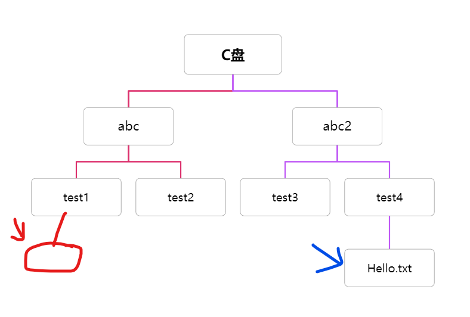
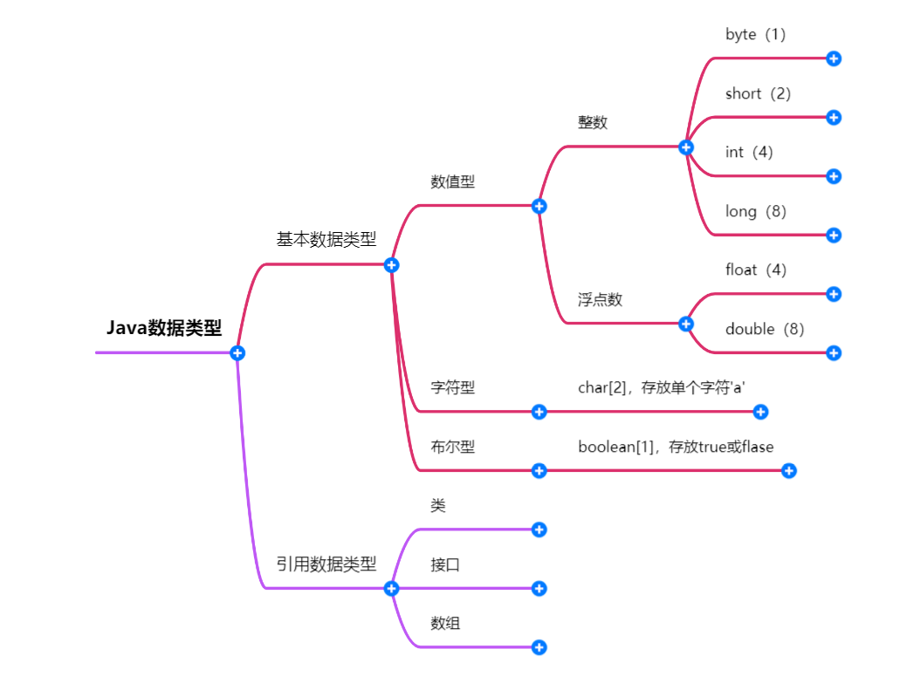

#  JAVA基础学习

学习前准备：就业方向、应用场景、ide安装

1.java的特性：面向对象、健壮性、多平台、解释型语言

2.jdk的选择：选择长期支持版，java8、java11、java17，其中java8的支持应该是最久的

3.学习方法：明确需求，使用已经学过的技术考虑能否实现，不能实现寻找新技术，先了解一下技术的特性，熟悉基础的指令和语法，做出一些简单的模板项目，先简单地实现出来，然后优化项目，理解新技术的底层原理，以此循环螺旋上升

## 第一阶段

### 转义字符

\t 制表位

\n 换行

\r 回车（这个是直接把光标跳转到这一行的开头，不换行，会从第一个字开始替换，如果打印的话）

\" 显示“

\' 显示‘

\\\ 显示\

学会读报错

### 注释

注释很有必要写，良好的写注释习惯可以增加程序的可读性

注释不会被JVM执行

注释分为：单行注释、多行注释、文档注释

单行注释语法：// 注释内容（只能写一行）

多行注释语法：/* 注释内容（可以写好几行）*/

文档注释一般是写在类之前，可以使用javadoc命令生成一套网页文件，作为它的说明文档

文档注释的语法：/**（注意这里是两个星号）

*（这里写标签，有作者版本等等）

*/（这里是一个标签）

### DOS命令

dos原理、常用命令、相对路径和绝对路径

相对路径：从当前目录开始定位的路径

绝对路径：从根目录开始定位的路径

用一张图来搞懂什么是绝对路径什么是相对路径

此时，我要从红色部分文件，访问蓝色文件，以绝对路径和相对路径进行访问

如果用绝对路径访问的话，应该是C:\abc2\test4\Hello.txt，这个倒是一目了然，不用太多解释

用相对路径，..\\..\abc2\test4\Hello.txt，这里的..\表示去往上级目录，因为此时红色文件是在test目录下，所以需要先回到上级abc目录下，再回到C盘目录下，然后再进入abc2、test4，访问到Hello.txt

dos常用命令

常量和加号的使用方法

### 数据类型

这里要注意基本数据类型的转换，注意可能会有溢出问题，低精度转高精度不抛出异常，高精度转低精度可能会抛出异常

### 运算符

java当中运算符有算术运算符、关系运算符、赋值运算符、逻辑运算符、三元运算符

#### 算术运算符

算术运算符包括加减乘除那些，这里尤其注意除法和求模，除法是取整，求模是取余

自增和自减

搞清楚i++和++i的区别，假设i现在为1

前置自增（即++i）是先运算再赋值，结果是2

后置自增（即i++）是先赋值再运算，结果是1

#### 关系运算符

#### 赋值运算符

#### 逻辑运算符

#### 三元运算符

